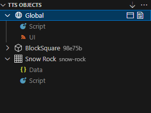

This view gives you an overview of all the objects that currently have scripts on the table.
Expand each object to see which scripts the objects have attached.
Clicking on the script (e.g. `Script` or `UI`) will open the script file.
You can also see the data file for each object.

Hovering over an object will show you additional command you can perform on the object.
Right-clicking an object adds even more commands.

